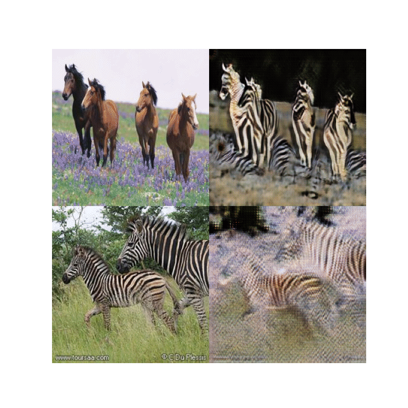

# Cycle-GANs-from-scratch
Implementing Cycle GANs from scratch in PyTorch

## Results for apples to oranges after epoch 0, 1, 2 (in order)

  

## Results Progression for horses to zebra translation from epoch 20 to epoch 27 

  

